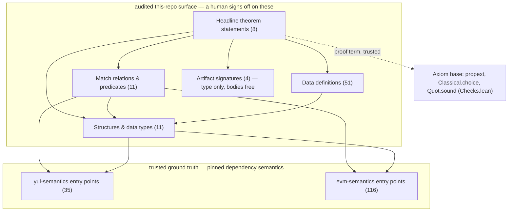

# The audited specification boundary

> **Generated by `SpecClosure.lean` — do not edit by hand.**
> Regenerate with `lake env lean SpecClosure.lean`.

This is the *minimal stable spec*: the declarations a human must read and
agree with to trust that the correctness theorems say what they should. It is
computed by walking each headline theorem's **statement** (never its proof),
so the hundreds of preservation lemmas are excluded automatically — what
remains is exactly the specification vocabulary.

**Audited surface: 86 declarations** \
relations: 11 · structures: 11 · data defs: 51 · statements: 8 · artifact signatures: 4 \
**External boundary: 151 declarations** across the two pinned semantics.

Axioms are pinned separately in `Checks.lean` (only `propext`,
`Classical.choice`, `Quot.sound`). Anti-vacuity (that the accepted-program
coverage never shrinks) is enforced by the differential corpora in CI; see
`DESIGN.md`.

## The boundary at a glance

## Audited this-repo surface

### Theorem statements

The shape of each guarantee. Read these first: the honest scoping lives here.

| declaration | hash |
|---|---|
| `YulEvmCompiler.compileObject_consistent` | `6772c506631c72d` |
| `YulEvmCompiler.compileObject_correct` | `6c28d636cabfed71` |
| `YulEvmCompiler.compile_correct` | `ec51f1c553a52f8a` |
| `YulEvmCompiler.compile_correct_eval` | `999e96fc09d553b6` |
| `YulEvmCompiler.compile_correct_withPayload` | `50e2c3107c79f9ea` |
| `YulEvmCompiler.compiled_constructor_returns` | `9a99d76f5d037853` |
| `YulParser.parse_canon_block` | `565944a3acfe55d3` |
| `YulParser.parse_canon_obj` | `f40759b3ea852432` |

### Match relations & predicates (bodies audited)

How a source state/outcome corresponds to a target state/outcome. The heart of the spec.

| declaration | hash |
|---|---|
| `YulEvmCompiler.HaltMatch` | `6557b5faae906a61` |
| `YulEvmCompiler.HaltedMatch` | `bd6cde934ed46ce6` |
| `YulEvmCompiler.IsCallOp` | `93349e44f6cba900` |
| `YulEvmCompiler.IsCreateOp` | `188d5668d6c00b2b` |
| `YulEvmCompiler.LogEntryMatch` | `44220474a51dc6b6` |
| `YulEvmCompiler.LogsMatch` | `6d1d2dd35bc25e39` |
| `YulEvmCompiler.MemMatch` | `e48211ef54b0d862` |
| `YulEvmCompiler.RunResolvedObject` | `22471129a83f65e3` |
| `YulEvmCompiler.SelfdestructEntryMatch` | `3b1f6c17c9cc3b3f` |
| `YulEvmCompiler.SelfdestructsMatch` | `8fb6a9b19498848` |
| `YulParser.Parser` | `c3c38aa9630539e` |

### Structures & data types (fields audited)

The vocabulary the guarantee is phrased in.

| declaration | hash |
|---|---|
| `YulEvmCompiler.CallsRealized` | `64c9e18484d6ee24` |
| `YulEvmCompiler.CreatesRealized` | `c1cd779310c8070e` |
| `YulEvmCompiler.EnvMatch` | `9cea97fa8ae94f99` |
| `YulEvmCompiler.ExternalCodeMatch` | `2d46717e52ff1871` |
| `YulEvmCompiler.ExternalModel` | `75bd1eadd7f209e2` |
| `YulEvmCompiler.ExternalsRealized` | `7fd85ee803561fa8` |
| `YulEvmCompiler.FrameOK` | `97dc148ae9bebed5` |
| `YulEvmCompiler.Instr` | `b8989862a6923efc` |
| `YulEvmCompiler.StateMatch` | `79c6c401a5fb18ee` |
| `YulParser.CTok` | `f0018424d20ab2ce` |
| `YulParser.QuotedScan` | `fda150592f3cfc21` |

### Data definitions (bodies audited)

Concrete spec-level functions (outcome maps, canonicalisation, byte assembly).

| declaration | hash |
|---|---|
| `YulEvmCompiler.Instr.bytes` | `cb67215ba3c17cde` |
| `YulEvmCompiler.Instr.opByte` | `1063189e226fb3ef` |
| `YulEvmCompiler.assemble` | `c1c9c0c9a1ad80c8` |
| `YulEvmCompiler.assembleBytes` | `29d8e692638cce98` |
| `YulEvmCompiler.assembleWithPayload` | `55ba5256c2c91c08` |
| `YulEvmCompiler.conv` | `25e701af8a9ce7bb` |
| `YulEvmCompiler.mkCode` | `edacb826e56f9571` |
| `YulEvmCompiler.natToBE` | `d47a19daef761803` |
| `YulEvmCompiler.opTable` | `e1b0c299397baebd` |
| `YulEvmCompiler.resolveForLayoutCases` | `a635c809600d2d8a` |
| `YulEvmCompiler.resolveForLayoutExpr` | `15bc9ca915a17f5a` |
| `YulEvmCompiler.resolveForLayoutExprs` | `deee862dd8d61de4` |
| `YulEvmCompiler.resolveForLayoutStmt` | `ef48ed8902b73d01` |
| `YulEvmCompiler.resolveForLayoutStmts` | `e61eedc003fbb530` |
| `YulEvmCompiler.resultOf` | `9a4fae748007bd7b` |
| `YulParser.afterBlockComment` | `5deac78dd9073c67` |
| `YulParser.canon` | `b2d8eb356dc83a9c` |
| `YulParser.decDigitVal` | `aa9b35f8e24246bf` |
| `YulParser.decDigits` | `93681863713f8772` |
| `YulParser.digitChar` | `bcde7b79f84349d3` |
| `YulParser.evalDec` | `2589fcab0b0b1f30` |
| `YulParser.evalHex` | `ac0c5eeed7026dc3` |
| `YulParser.hexDigitVal` | `c4e40fb8db1bdaa8` |
| `YulParser.isDigitC` | `2e23993f4305ca29` |
| `YulParser.isHexDigitC` | `98897dc36c763b56` |
| `YulParser.isIdCont` | `99e813f13d1ba0b5` |
| `YulParser.isIdStart` | `88b65d8694f2e093` |
| `YulParser.isNumCont` | `b0cd4e6da5b47fc` |
| `YulParser.isWs` | `1ad606963d724ee0` |
| `YulParser.numVal` | `36fa963744b7f765` |
| `YulParser.pQuotedChars` | `12116502d0932a55` |
| `YulParser.printArgsC` | `fb7f406415221f23` |
| `YulParser.printArgsTailC` | `e3f69b37a503a89e` |
| `YulParser.printBlockC` | `95b7a427f26cf532` |
| `YulParser.printCS` | `3287ad224aefbc8d` |
| `YulParser.printCS1` | `2d9a080387cd904f` |
| `YulParser.printCasesC` | `625001fdca03af40` |
| `YulParser.printDataC` | `a9434095c401bde` |
| `YulParser.printDatasC` | `8fbdb53b7d48df2b` |
| `YulParser.printExprC` | `a56c648c2737a8d3` |
| `YulParser.printId` | `ad633beed9cc9c7c` |
| `YulParser.printLitC` | `b9cec7d002c6808a` |
| `YulParser.printManyC` | `e5456a769d4dc16d` |
| `YulParser.printNameC` | `b0caa18fdf398b08` |
| `YulParser.printObjC` | `e2186fbe4e35780a` |
| `YulParser.printStmtC` | `3de2e9120bc6a272` |
| `YulParser.printStmtsC` | `edd2b2fc3c962c96` |
| `YulParser.printStringC` | `ae7fc4513c9611b4` |
| `YulParser.printSubsC` | `88f936b77e898d85` |
| `YulParser.quotedBody` | `5e9244808f044035` |
| `YulParser.scanQuoted` | `ad86fca43b5d2cb6` |

### Artifact signatures (type only — bodies may change freely)

The code being verified. Only the signatures are frozen; implementations are free.

| declaration | hash |
|---|---|
| `YulEvmCompiler.compile` | `49a8d9e93773bc82` |
| `YulEvmCompiler.compileObject` | `45cacb379f48e375` |
| `YulParser.parseBlock` | `548f44114c0c0376` |
| `YulParser.parseObject` | `7de98252fdadddab` |

### Other (signatures only)

Recursors/auxiliary constants reached through a type.

| declaration | hash |
|---|---|
| `YulParser.pQuotedChars_rest_lt` | `bf5ffe92f6739f95` |

## External-semantics boundary (151 decls, combined hash `d1238cc2a8e2b0b8`)

The entry points of the two pinned semantics the guarantee is stated against.
These are trusted ground truth (auditing them = believing they model real Yul
and real EVM); they are recorded but not unfolded.

### yul-sem (35)

`YulSemantics.Block`, `YulSemantics.Data`, `YulSemantics.Data.bytes`, `YulSemantics.Data.size`, `YulSemantics.EVM.EvmState`, `YulSemantics.EVM.ExecEnv`, `YulSemantics.EVM.ExternalCalls`, `YulSemantics.EVM.ExternalCalls.none`, `YulSemantics.EVM.ExternalCreates`, `YulSemantics.EVM.HaltKind`, `YulSemantics.EVM.Layout`, `YulSemantics.EVM.Layout.Consistent`, `YulSemantics.EVM.Layout.initState`, `YulSemantics.EVM.LogEntry`, `YulSemantics.EVM.Op`, `YulSemantics.EVM.U256`, `YulSemantics.EVM.builtin`, `YulSemantics.EVM.builtinWithExternal`, `YulSemantics.EVM.byteFrom`, `YulSemantics.EVM.constructorCode`, `YulSemantics.EVM.evm`, `YulSemantics.EVM.evmWithExternal`, `YulSemantics.EVM.litValue`, `YulSemantics.EVM.opName`, `YulSemantics.EVM.projectedCodeHash`, `YulSemantics.Expr`, `YulSemantics.Ident`, `YulSemantics.Literal`, `YulSemantics.Object`, `YulSemantics.Object.codeBlock`, `YulSemantics.Object.dataSegs`, `YulSemantics.Outcome`, `YulSemantics.Run`, `YulSemantics.Stmt`, `YulSemantics.VEnv`

### evm-sem (116)

`EvmSemantics.Account.codeHash`, `EvmSemantics.Account.isContract`, `EvmSemantics.AccountAddress`, `EvmSemantics.AccountAddress.ofUInt256`, `EvmSemantics.AccountAddress.toUInt256`, `EvmSemantics.AccountMap`, `EvmSemantics.AccountMap.get`, `EvmSemantics.EVM.Eval`, `EvmSemantics.EVM.ExecutionResult`, `EvmSemantics.EVM.Frame`, `EvmSemantics.EVM.Precompile.isPrecompile`, `EvmSemantics.EVM.State`, `EvmSemantics.EVM.State.decodedOp`, `EvmSemantics.EVM.Steps`, `EvmSemantics.ExecutionEnv`, `EvmSemantics.Fork`, `EvmSemantics.HaltKind`, `EvmSemantics.LogEntry`, `EvmSemantics.LogSeries`, `EvmSemantics.Operation`, `EvmSemantics.Operation.ADD`, `EvmSemantics.Operation.ADDMOD`, `EvmSemantics.Operation.ADDRESS`, `EvmSemantics.Operation.AND`, `EvmSemantics.Operation.BALANCE`, `EvmSemantics.Operation.BASEFEE`, `EvmSemantics.Operation.BLOBBASEFEE`, `EvmSemantics.Operation.BLOBHASH`, `EvmSemantics.Operation.BLOCKHASH`, `EvmSemantics.Operation.BYTE`, `EvmSemantics.Operation.BlockOps`, `EvmSemantics.Operation.CALL`, `EvmSemantics.Operation.CALLCODE`, `EvmSemantics.Operation.CALLDATACOPY`, `EvmSemantics.Operation.CALLDATALOAD`, `EvmSemantics.Operation.CALLDATASIZE`, `EvmSemantics.Operation.CALLER`, `EvmSemantics.Operation.CALLVALUE`, `EvmSemantics.Operation.CHAINID`, `EvmSemantics.Operation.CLZ`, `EvmSemantics.Operation.CODECOPY`, `EvmSemantics.Operation.CODESIZE`, `EvmSemantics.Operation.COINBASE`, `EvmSemantics.Operation.CREATE`, `EvmSemantics.Operation.CREATE2`, `EvmSemantics.Operation.CompareBitwiseOps`, `EvmSemantics.Operation.DELEGATECALL`, `EvmSemantics.Operation.DIV`, `EvmSemantics.Operation.DupNOp`, `EvmSemantics.Operation.DupOp`, `EvmSemantics.Operation.EQ`, `EvmSemantics.Operation.EXP`, `EvmSemantics.Operation.EXTCODECOPY`, `EvmSemantics.Operation.EXTCODEHASH`, `EvmSemantics.Operation.EXTCODESIZE`, `EvmSemantics.Operation.EnvOps`, `EvmSemantics.Operation.ExchangeOp`, `EvmSemantics.Operation.GASLIMIT`, `EvmSemantics.Operation.GASPRICE`, `EvmSemantics.Operation.GT`, `EvmSemantics.Operation.INVALID`, `EvmSemantics.Operation.ISZERO`, `EvmSemantics.Operation.KECCAK256`, `EvmSemantics.Operation.KeccakOps`, `EvmSemantics.Operation.LT`, `EvmSemantics.Operation.LogOp`, `EvmSemantics.Operation.MCOPY`, `EvmSemantics.Operation.MLOAD`, `EvmSemantics.Operation.MOD`, `EvmSemantics.Operation.MSIZE`, `EvmSemantics.Operation.MSTORE`, `EvmSemantics.Operation.MSTORE8`, `EvmSemantics.Operation.MUL`, `EvmSemantics.Operation.MULMOD`, `EvmSemantics.Operation.NOT`, `EvmSemantics.Operation.NUMBER`, `EvmSemantics.Operation.OR`, `EvmSemantics.Operation.ORIGIN`, `EvmSemantics.Operation.POP`, `EvmSemantics.Operation.PREVRANDAO`, `EvmSemantics.Operation.PushOp`, `EvmSemantics.Operation.RETURN`, `EvmSemantics.Operation.RETURNDATACOPY`, `EvmSemantics.Operation.RETURNDATASIZE`, `EvmSemantics.Operation.REVERT`, `EvmSemantics.Operation.SAR`, `EvmSemantics.Operation.SDIV`, `EvmSemantics.Operation.SELFBALANCE`, `EvmSemantics.Operation.SELFDESTRUCT`, `EvmSemantics.Operation.SGT`, `EvmSemantics.Operation.SHL`, `EvmSemantics.Operation.SHR`, `EvmSemantics.Operation.SIGNEXTEND`, `EvmSemantics.Operation.SLOAD`, `EvmSemantics.Operation.SLT`, `EvmSemantics.Operation.SMOD`, `EvmSemantics.Operation.SSTORE`, `EvmSemantics.Operation.STATICCALL`, `EvmSemantics.Operation.STOP`, `EvmSemantics.Operation.SUB`, `EvmSemantics.Operation.StackMemFlowOps`, `EvmSemantics.Operation.StopArithOps`, `EvmSemantics.Operation.SwapNOp`, `EvmSemantics.Operation.SwapOp`, `EvmSemantics.Operation.SystemOps`, `EvmSemantics.Operation.TIMESTAMP`, `EvmSemantics.Operation.TLOAD`, `EvmSemantics.Operation.TSTORE`, `EvmSemantics.Operation.XOR`, `EvmSemantics.Storage.get`, `EvmSemantics.UInt256`, `EvmSemantics.UInt256.ofNat`, `EvmSemantics.UInt256.size`, `EvmSemantics.UInt256.succ`, `EvmSemantics.UInt256.toNat`, `EvmSemantics.keccak256`
