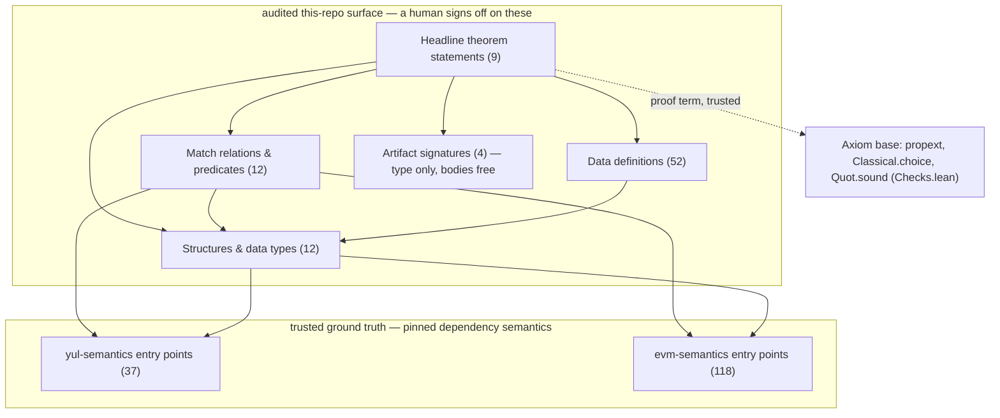

# The audited specification boundary

> **Generated by `SpecClosure.lean` — do not edit by hand.**
> Regenerate with `lake env lean SpecClosure.lean`.

This is the *minimal stable spec*: the declarations a human must read and
agree with to trust that the correctness theorems say what they should. It is
computed by walking each headline theorem's **statement** (never its proof),
so the hundreds of preservation lemmas are excluded automatically — what
remains is exactly the specification vocabulary.

**Audited surface: 90 declarations** \
relations: 12 · structures: 12 · data defs: 52 · statements: 9 · artifact signatures: 4 \
**External boundary: 155 declarations** across the two pinned semantics.

Axioms are pinned separately in `Checks.lean` (only `propext`,
`Classical.choice`, `Quot.sound`). Anti-vacuity (that the accepted-program
coverage never shrinks) is enforced by the differential corpora in CI; see
`DESIGN.md`.

## The boundary at a glance

```mermaid
flowchart TD
  subgraph audited ["audited this-repo surface — a human signs off on these"]
    S["Headline theorem statements (9)"]
    R["Match relations & predicates (12)"]
    T["Structures & data types (12)"]
    D["Data definitions (52)"]
    A["Artifact signatures (4) — type only, bodies free"]
  end
  subgraph external ["trusted ground truth — pinned dependency semantics"]
    YUL["yul-semantics entry points (37)"]
    EVM["evm-semantics entry points (118)"]
  end
  AX["Axiom base: propext, Classical.choice, Quot.sound (Checks.lean)"]
  S --> R & T & D & A
  R --> T & YUL & EVM
  D --> T
  T --> YUL & EVM
  S -.->|proof term, trusted| AX
```

## Audited this-repo surface

### Theorem statements

The shape of each guarantee. Read these first: the honest scoping lives here.

| declaration | source | hash |
|---|---|---|
| `YulEvmCompiler.Optimizer.LocalPass.optimize_then_compile_correct` | [YulEvmCompiler/Optimizer/Spec/Backend.lean#L30](YulEvmCompiler/Optimizer/Spec/Backend.lean#L30) | `d0b206bd07992491` |
| `YulEvmCompiler.compileObject_consistent` | [YulEvmCompiler/ObjectCompile.lean#L1025](YulEvmCompiler/ObjectCompile.lean#L1025) | `6772c506631c72d` |
| `YulEvmCompiler.compileObject_correct` | [YulEvmCompiler/ObjectCompile.lean#L1048](YulEvmCompiler/ObjectCompile.lean#L1048) | `6c28d636cabfed71` |
| `YulEvmCompiler.compile_correct` | [YulEvmCompiler/Correctness.lean#L71](YulEvmCompiler/Correctness.lean#L71) | `5da903b63e70655d` |
| `YulEvmCompiler.compile_correct_eval` | [YulEvmCompiler/Correctness.lean#L267](YulEvmCompiler/Correctness.lean#L267) | `44f9f79182ec7eda` |
| `YulEvmCompiler.compile_correct_withPayload` | [YulEvmCompiler/Correctness.lean#L179](YulEvmCompiler/Correctness.lean#L179) | `7fe10d0f9ce8438a` |
| `YulEvmCompiler.compiled_constructor_returns` | [YulEvmCompiler/ObjectCompile.lean#L1086](YulEvmCompiler/ObjectCompile.lean#L1086) | `9a99d76f5d037853` |
| `YulParser.parse_canon_block` | [YulParser/Stmt.lean#L313](YulParser/Stmt.lean#L313) | `565944a3acfe55d3` |
| `YulParser.parse_canon_obj` | [YulParser/Obj.lean#L139](YulParser/Obj.lean#L139) | `f40759b3ea852432` |

### Match relations & predicates (bodies audited)

How a source state/outcome corresponds to a target state/outcome. The heart of the spec.

| declaration | source | hash |
|---|---|---|
| `YulEvmCompiler.HaltMatch` | [YulEvmCompiler/StateRel.lean#L1252](YulEvmCompiler/StateRel.lean#L1252) | `6557b5faae906a61` |
| `YulEvmCompiler.HaltedMatch` | [YulEvmCompiler/OpStep.lean#L50](YulEvmCompiler/OpStep.lean#L50) | `bd6cde934ed46ce6` |
| `YulEvmCompiler.IsCallOp` | [YulEvmCompiler/OpTable.lean#L90](YulEvmCompiler/OpTable.lean#L90) | `4068ec650592c03e` |
| `YulEvmCompiler.IsCreateOp` | [YulEvmCompiler/OpTable.lean#L98](YulEvmCompiler/OpTable.lean#L98) | `b78befe1df320f16` |
| `YulEvmCompiler.LogEntryMatch` | [YulEvmCompiler/StateRel.lean#L934](YulEvmCompiler/StateRel.lean#L934) | `44220474a51dc6b6` |
| `YulEvmCompiler.LogsMatch` | [YulEvmCompiler/StateRel.lean#L942](YulEvmCompiler/StateRel.lean#L942) | `6d1d2dd35bc25e39` |
| `YulEvmCompiler.MemMatch` | [YulEvmCompiler/StateRel.lean#L32](YulEvmCompiler/StateRel.lean#L32) | `e48211ef54b0d862` |
| `YulEvmCompiler.Optimizer.Sound` | [YulEvmCompiler/Optimizer/Spec/LocalPass.lean#L64](YulEvmCompiler/Optimizer/Spec/LocalPass.lean#L64) | `d9d7947b1bb2287` |
| `YulEvmCompiler.RunResolvedObject` | [YulEvmCompiler/ObjectCompile.lean#L1042](YulEvmCompiler/ObjectCompile.lean#L1042) | `22471129a83f65e3` |
| `YulEvmCompiler.SelfdestructEntryMatch` | [YulEvmCompiler/StateRel.lean#L956](YulEvmCompiler/StateRel.lean#L956) | `3b1f6c17c9cc3b3f` |
| `YulEvmCompiler.SelfdestructsMatch` | [YulEvmCompiler/StateRel.lean#L963](YulEvmCompiler/StateRel.lean#L963) | `8fb6a9b19498848` |
| `YulParser.Parser` | [YulParser/Core.lean#L13](YulParser/Core.lean#L13) | `c3c38aa9630539e` |

### Structures & data types (fields audited)

The vocabulary the guarantee is phrased in.

| declaration | source | hash |
|---|---|---|
| `YulEvmCompiler.CallsRealized` | [YulEvmCompiler/LowerDefs.lean#L329](YulEvmCompiler/LowerDefs.lean#L329) | `60cec34bf4c3cac9` |
| `YulEvmCompiler.CreatesRealized` | [YulEvmCompiler/LowerDefs.lean#L376](YulEvmCompiler/LowerDefs.lean#L376) | `d608d1effb3509d1` |
| `YulEvmCompiler.EnvMatch` | [YulEvmCompiler/StateRel.lean#L429](YulEvmCompiler/StateRel.lean#L429) | `9cea97fa8ae94f99` |
| `YulEvmCompiler.ExternalCodeMatch` | [YulEvmCompiler/StateRel.lean#L494](YulEvmCompiler/StateRel.lean#L494) | `2d46717e52ff1871` |
| `YulEvmCompiler.ExternalModel` | [YulEvmCompiler/AsmSem.lean#L34](YulEvmCompiler/AsmSem.lean#L34) | `75bd1eadd7f209e2` |
| `YulEvmCompiler.ExternalsRealized` | [YulEvmCompiler/LowerDefs.lean#L424](YulEvmCompiler/LowerDefs.lean#L424) | `7fd85ee803561fa8` |
| `YulEvmCompiler.FrameOK` | [YulEvmCompiler/StateRel.lean#L1240](YulEvmCompiler/StateRel.lean#L1240) | `97dc148ae9bebed5` |
| `YulEvmCompiler.Instr` | [YulEvmCompiler/Instr.lean#L38](YulEvmCompiler/Instr.lean#L38) | `6d2465d1d211750b` |
| `YulEvmCompiler.Optimizer.LocalPass` | [YulEvmCompiler/Optimizer/Spec/LocalPass.lean#L72](YulEvmCompiler/Optimizer/Spec/LocalPass.lean#L72) | `6b8887154f59257c` |
| `YulEvmCompiler.StateMatch` | [YulEvmCompiler/StateRel.lean#L982](YulEvmCompiler/StateRel.lean#L982) | `79c6c401a5fb18ee` |
| `YulParser.CTok` | [YulParser/Canon.lean#L34](YulParser/Canon.lean#L34) | `f0018424d20ab2ce` |
| `YulParser.QuotedScan` | [YulParser/Lexer.lean#L63](YulParser/Lexer.lean#L63) | `fda150592f3cfc21` |

### Data definitions (bodies audited)

Concrete spec-level functions (outcome maps, canonicalisation, byte assembly).

| declaration | source | hash |
|---|---|---|
| `YulEvmCompiler.Instr.bytes` | [YulEvmCompiler/Instr.lean#L86](YulEvmCompiler/Instr.lean#L86) | `6cb9a3bc72e0ae11` |
| `YulEvmCompiler.Instr.opByte` | [YulEvmCompiler/Instr.lean#L52](YulEvmCompiler/Instr.lean#L52) | `1063189e226fb3ef` |
| `YulEvmCompiler.assemble` | [YulEvmCompiler/Instr.lean#L188](YulEvmCompiler/Instr.lean#L188) | `c1c9c0c9a1ad80c8` |
| `YulEvmCompiler.assembleBytes` | [YulEvmCompiler/Instr.lean#L176](YulEvmCompiler/Instr.lean#L176) | `29d8e692638cce98` |
| `YulEvmCompiler.assembleWithPayload` | [YulEvmCompiler/LowerDefs.lean#L144](YulEvmCompiler/LowerDefs.lean#L144) | `55ba5256c2c91c08` |
| `YulEvmCompiler.conv` | [YulEvmCompiler/Value.lean#L29](YulEvmCompiler/Value.lean#L29) | `25e701af8a9ce7bb` |
| `YulEvmCompiler.mkCode` | [YulEvmCompiler/Decode.lean#L23](YulEvmCompiler/Decode.lean#L23) | `edacb826e56f9571` |
| `YulEvmCompiler.natToBE` | [YulEvmCompiler/Instr.lean#L26](YulEvmCompiler/Instr.lean#L26) | `d47a19daef761803` |
| `YulEvmCompiler.opTable` | [YulEvmCompiler/OpTable.lean#L19](YulEvmCompiler/OpTable.lean#L19) | `d48771ade3ef37b6` |
| `YulEvmCompiler.resolveForLayoutCases` | [YulEvmCompiler/ObjectResolve.lean#L77](YulEvmCompiler/ObjectResolve.lean#L77) | `a635c809600d2d8a` |
| `YulEvmCompiler.resolveForLayoutExpr` | [YulEvmCompiler/ObjectResolve.lean#L25](YulEvmCompiler/ObjectResolve.lean#L25) | `6e8a6c9691954597` |
| `YulEvmCompiler.resolveForLayoutExprs` | [YulEvmCompiler/ObjectResolve.lean#L38](YulEvmCompiler/ObjectResolve.lean#L38) | `deee862dd8d61de4` |
| `YulEvmCompiler.resolveForLayoutStmt` | [YulEvmCompiler/ObjectResolve.lean#L45](YulEvmCompiler/ObjectResolve.lean#L45) | `ef48ed8902b73d01` |
| `YulEvmCompiler.resolveForLayoutStmts` | [YulEvmCompiler/ObjectResolve.lean#L71](YulEvmCompiler/ObjectResolve.lean#L71) | `e61eedc003fbb530` |
| `YulEvmCompiler.resultOf` | [YulEvmCompiler/StateRel.lean#L1264](YulEvmCompiler/StateRel.lean#L1264) | `9a4fae748007bd7b` |
| `YulEvmCompiler.unpatchedImmutables` | [YulEvmCompiler/Compile.lean#L342](YulEvmCompiler/Compile.lean#L342) | `4350bdab12d0a1ca` |
| `YulParser.afterBlockComment` | [YulParser/Tokens.lean#L30](YulParser/Tokens.lean#L30) | `5deac78dd9073c67` |
| `YulParser.canon` | [YulParser/Canon.lean#L82](YulParser/Canon.lean#L82) | `b2d8eb356dc83a9c` |
| `YulParser.decDigitVal` | [YulParser/Canon.lean#L52](YulParser/Canon.lean#L52) | `aa9b35f8e24246bf` |
| `YulParser.decDigits` | [YulParser/Atoms.lean#L90](YulParser/Atoms.lean#L90) | `93681863713f8772` |
| `YulParser.digitChar` | [YulParser/Atoms.lean#L87](YulParser/Atoms.lean#L87) | `bcde7b79f84349d3` |
| `YulParser.evalDec` | [YulParser/Canon.lean#L58](YulParser/Canon.lean#L58) | `2589fcab0b0b1f30` |
| `YulParser.evalHex` | [YulParser/Canon.lean#L55](YulParser/Canon.lean#L55) | `ac0c5eeed7026dc3` |
| `YulParser.hexDigitVal` | [YulParser/Canon.lean#L45](YulParser/Canon.lean#L45) | `c4e40fb8db1bdaa8` |
| `YulParser.isDigitC` | [YulParser/Lexer.lean#L14](YulParser/Lexer.lean#L14) | `2e23993f4305ca29` |
| `YulParser.isHexDigitC` | [YulParser/Lexer.lean#L15](YulParser/Lexer.lean#L15) | `98897dc36c763b56` |
| `YulParser.isIdCont` | [YulParser/Lexer.lean#L18](YulParser/Lexer.lean#L18) | `99e813f13d1ba0b5` |
| `YulParser.isIdStart` | [YulParser/Lexer.lean#L17](YulParser/Lexer.lean#L17) | `88b65d8694f2e093` |
| `YulParser.isNumCont` | [YulParser/Canon.lean#L61](YulParser/Canon.lean#L61) | `b0cd4e6da5b47fc` |
| `YulParser.isWs` | [YulParser/Core.lean#L10](YulParser/Core.lean#L10) | `1ad606963d724ee0` |
| `YulParser.numVal` | [YulParser/Canon.lean#L65](YulParser/Canon.lean#L65) | `36fa963744b7f765` |
| `YulParser.pQuotedChars` | [YulParser/Lexer.lean#L43](YulParser/Lexer.lean#L43) | `12116502d0932a55` |
| `YulParser.printArgsC` | [YulParser/Expr.lean#L50](YulParser/Expr.lean#L50) | `fb7f406415221f23` |
| `YulParser.printArgsTailC` | [YulParser/Expr.lean#L54](YulParser/Expr.lean#L54) | `e3f69b37a503a89e` |
| `YulParser.printBlockC` | [YulParser/Stmt.lean#L301](YulParser/Stmt.lean#L301) | `95b7a427f26cf532` |
| `YulParser.printCS` | [YulParser/Stmt.lean#L40](YulParser/Stmt.lean#L40) | `3287ad224aefbc8d` |
| `YulParser.printCS1` | [YulParser/Stmt.lean#L36](YulParser/Stmt.lean#L36) | `2d9a080387cd904f` |
| `YulParser.printCasesC` | [YulParser/Stmt.lean#L114](YulParser/Stmt.lean#L114) | `625001fdca03af40` |
| `YulParser.printDataC` | [YulParser/Obj.lean#L46](YulParser/Obj.lean#L46) | `a9434095c401bde` |
| `YulParser.printDatasC` | [YulParser/Obj.lean#L71](YulParser/Obj.lean#L71) | `8fbdb53b7d48df2b` |
| `YulParser.printExprC` | [YulParser/Expr.lean#L41](YulParser/Expr.lean#L41) | `a56c648c2737a8d3` |
| `YulParser.printId` | [YulParser/Stmt.lean#L59](YulParser/Stmt.lean#L59) | `ad633beed9cc9c7c` |
| `YulParser.printLitC` | [YulParser/Atoms.lean#L190](YulParser/Atoms.lean#L190) | `b9cec7d002c6808a` |
| `YulParser.printManyC` | [YulParser/SoundC.lean#L102](YulParser/SoundC.lean#L102) | `e5456a769d4dc16d` |
| `YulParser.printNameC` | [YulParser/Obj.lean#L31](YulParser/Obj.lean#L31) | `b0caa18fdf398b08` |
| `YulParser.printObjC` | [YulParser/Obj.lean#L61](YulParser/Obj.lean#L61) | `e2186fbe4e35780a` |
| `YulParser.printStmtC` | [YulParser/Stmt.lean#L79](YulParser/Stmt.lean#L79) | `3de2e9120bc6a272` |
| `YulParser.printStmtsC` | [YulParser/Stmt.lean#L110](YulParser/Stmt.lean#L110) | `edd2b2fc3c962c96` |
| `YulParser.printStringC` | [YulParser/Atoms.lean#L186](YulParser/Atoms.lean#L186) | `ae7fc4513c9611b4` |
| `YulParser.printSubsC` | [YulParser/Obj.lean#L67](YulParser/Obj.lean#L67) | `88f936b77e898d85` |
| `YulParser.quotedBody` | [YulParser/Lexer.lean#L24](YulParser/Lexer.lean#L24) | `5e9244808f044035` |
| `YulParser.scanQuoted` | [YulParser/Lexer.lean#L68](YulParser/Lexer.lean#L68) | `ad86fca43b5d2cb6` |

### Artifact signatures (type only — bodies may change freely)

The code being verified. Only the signatures are frozen; implementations are free.

| declaration | source | hash |
|---|---|---|
| `YulEvmCompiler.compile` | [YulEvmCompiler/Compile.lean#L352](YulEvmCompiler/Compile.lean#L352) | `8db82c40ac47d5a6` |
| `YulEvmCompiler.compileObject` | [YulEvmCompiler/ObjectCompile.lean#L922](YulEvmCompiler/ObjectCompile.lean#L922) | `45cacb379f48e375` |
| `YulParser.parseBlock` | [YulParser/Stmt.lean#L305](YulParser/Stmt.lean#L305) | `548f44114c0c0376` |
| `YulParser.parseObject` | [YulParser/Obj.lean#L131](YulParser/Obj.lean#L131) | `7de98252fdadddab` |

### Other (signatures only)

Recursors/auxiliary constants reached through a type.

| declaration | source | hash |
|---|---|---|
| `YulParser.pQuotedChars_rest_lt` | [YulParser/Lexer.lean#L53](YulParser/Lexer.lean#L53) | `bf5ffe92f6739f95` |

## External-semantics boundary (155 decls, combined hash `a8298506639ad1db`)

The entry points of the two pinned semantics the guarantee is stated against.
These are trusted ground truth (auditing them = believing they model real Yul
and real EVM); they are recorded but not unfolded.

### yul-sem (37)

`YulSemantics.Block`, `YulSemantics.Data`, `YulSemantics.Data.bytes`, `YulSemantics.Data.size`, `YulSemantics.Dialect`, `YulSemantics.EVM.EvmState`, `YulSemantics.EVM.ExecEnv`, `YulSemantics.EVM.ExternalCalls`, `YulSemantics.EVM.ExternalCalls.none`, `YulSemantics.EVM.ExternalCreates`, `YulSemantics.EVM.HaltKind`, `YulSemantics.EVM.Layout`, `YulSemantics.EVM.Layout.Consistent`, `YulSemantics.EVM.Layout.initState`, `YulSemantics.EVM.LogEntry`, `YulSemantics.EVM.Op`, `YulSemantics.EVM.U256`, `YulSemantics.EVM.builtin`, `YulSemantics.EVM.builtinWithExternal`, `YulSemantics.EVM.byteFrom`, `YulSemantics.EVM.constructorCode`, `YulSemantics.EVM.evm`, `YulSemantics.EVM.evmWithExternal`, `YulSemantics.EVM.litValue`, `YulSemantics.EVM.opName`, `YulSemantics.EVM.projectedCodeHash`, `YulSemantics.EquivBlock`, `YulSemantics.Expr`, `YulSemantics.Ident`, `YulSemantics.Literal`, `YulSemantics.Object`, `YulSemantics.Object.codeBlock`, `YulSemantics.Object.dataSegs`, `YulSemantics.Outcome`, `YulSemantics.Run`, `YulSemantics.Stmt`, `YulSemantics.VEnv`

### evm-sem (118)

`EvmSemantics.Account.codeHash`, `EvmSemantics.Account.isContract`, `EvmSemantics.AccountAddress`, `EvmSemantics.AccountAddress.ofUInt256`, `EvmSemantics.AccountAddress.toUInt256`, `EvmSemantics.AccountMap`, `EvmSemantics.AccountMap.get`, `EvmSemantics.EVM.Eval`, `EvmSemantics.EVM.ExecutionResult`, `EvmSemantics.EVM.Frame`, `EvmSemantics.EVM.Precompile.isPrecompile`, `EvmSemantics.EVM.State`, `EvmSemantics.EVM.State.decodedOp`, `EvmSemantics.EVM.Steps`, `EvmSemantics.ExecutionEnv`, `EvmSemantics.Fork`, `EvmSemantics.HaltKind`, `EvmSemantics.LogEntry`, `EvmSemantics.LogSeries`, `EvmSemantics.Operation`, `EvmSemantics.Operation.ADD`, `EvmSemantics.Operation.ADDMOD`, `EvmSemantics.Operation.ADDRESS`, `EvmSemantics.Operation.AND`, `EvmSemantics.Operation.BALANCE`, `EvmSemantics.Operation.BASEFEE`, `EvmSemantics.Operation.BLOBBASEFEE`, `EvmSemantics.Operation.BLOBHASH`, `EvmSemantics.Operation.BLOCKHASH`, `EvmSemantics.Operation.BYTE`, `EvmSemantics.Operation.BlockOps`, `EvmSemantics.Operation.CALL`, `EvmSemantics.Operation.CALLCODE`, `EvmSemantics.Operation.CALLDATACOPY`, `EvmSemantics.Operation.CALLDATALOAD`, `EvmSemantics.Operation.CALLDATASIZE`, `EvmSemantics.Operation.CALLER`, `EvmSemantics.Operation.CALLVALUE`, `EvmSemantics.Operation.CHAINID`, `EvmSemantics.Operation.CLZ`, `EvmSemantics.Operation.CODECOPY`, `EvmSemantics.Operation.CODESIZE`, `EvmSemantics.Operation.COINBASE`, `EvmSemantics.Operation.CREATE`, `EvmSemantics.Operation.CREATE2`, `EvmSemantics.Operation.CompareBitwiseOps`, `EvmSemantics.Operation.DELEGATECALL`, `EvmSemantics.Operation.DIV`, `EvmSemantics.Operation.DupNOp`, `EvmSemantics.Operation.DupOp`, `EvmSemantics.Operation.EQ`, `EvmSemantics.Operation.EXP`, `EvmSemantics.Operation.EXTCODECOPY`, `EvmSemantics.Operation.EXTCODEHASH`, `EvmSemantics.Operation.EXTCODESIZE`, `EvmSemantics.Operation.EnvOps`, `EvmSemantics.Operation.ExchangeOp`, `EvmSemantics.Operation.GASLIMIT`, `EvmSemantics.Operation.GASPRICE`, `EvmSemantics.Operation.GT`, `EvmSemantics.Operation.INVALID`, `EvmSemantics.Operation.ISZERO`, `EvmSemantics.Operation.KECCAK256`, `EvmSemantics.Operation.KeccakOps`, `EvmSemantics.Operation.LT`, `EvmSemantics.Operation.LogOp`, `EvmSemantics.Operation.MCOPY`, `EvmSemantics.Operation.MLOAD`, `EvmSemantics.Operation.MOD`, `EvmSemantics.Operation.MSIZE`, `EvmSemantics.Operation.MSTORE`, `EvmSemantics.Operation.MSTORE8`, `EvmSemantics.Operation.MUL`, `EvmSemantics.Operation.MULMOD`, `EvmSemantics.Operation.NOT`, `EvmSemantics.Operation.NUMBER`, `EvmSemantics.Operation.OR`, `EvmSemantics.Operation.ORIGIN`, `EvmSemantics.Operation.POP`, `EvmSemantics.Operation.PREVRANDAO`, `EvmSemantics.Operation.PushOp`, `EvmSemantics.Operation.RETURN`, `EvmSemantics.Operation.RETURNDATACOPY`, `EvmSemantics.Operation.RETURNDATASIZE`, `EvmSemantics.Operation.REVERT`, `EvmSemantics.Operation.SAR`, `EvmSemantics.Operation.SDIV`, `EvmSemantics.Operation.SELFBALANCE`, `EvmSemantics.Operation.SELFDESTRUCT`, `EvmSemantics.Operation.SGT`, `EvmSemantics.Operation.SHL`, `EvmSemantics.Operation.SHR`, `EvmSemantics.Operation.SIGNEXTEND`, `EvmSemantics.Operation.SLOAD`, `EvmSemantics.Operation.SLT`, `EvmSemantics.Operation.SMOD`, `EvmSemantics.Operation.SSTORE`, `EvmSemantics.Operation.STATICCALL`, `EvmSemantics.Operation.STOP`, `EvmSemantics.Operation.SUB`, `EvmSemantics.Operation.StackMemFlowOps`, `EvmSemantics.Operation.StopArithOps`, `EvmSemantics.Operation.SwapNOp`, `EvmSemantics.Operation.SwapOp`, `EvmSemantics.Operation.SystemOps`, `EvmSemantics.Operation.TIMESTAMP`, `EvmSemantics.Operation.TLOAD`, `EvmSemantics.Operation.TSTORE`, `EvmSemantics.Operation.XOR`, `EvmSemantics.Operation.popArity`, `EvmSemantics.Operation.pushArity`, `EvmSemantics.Storage.get`, `EvmSemantics.UInt256`, `EvmSemantics.UInt256.ofNat`, `EvmSemantics.UInt256.size`, `EvmSemantics.UInt256.succ`, `EvmSemantics.UInt256.toNat`, `EvmSemantics.keccak256`
